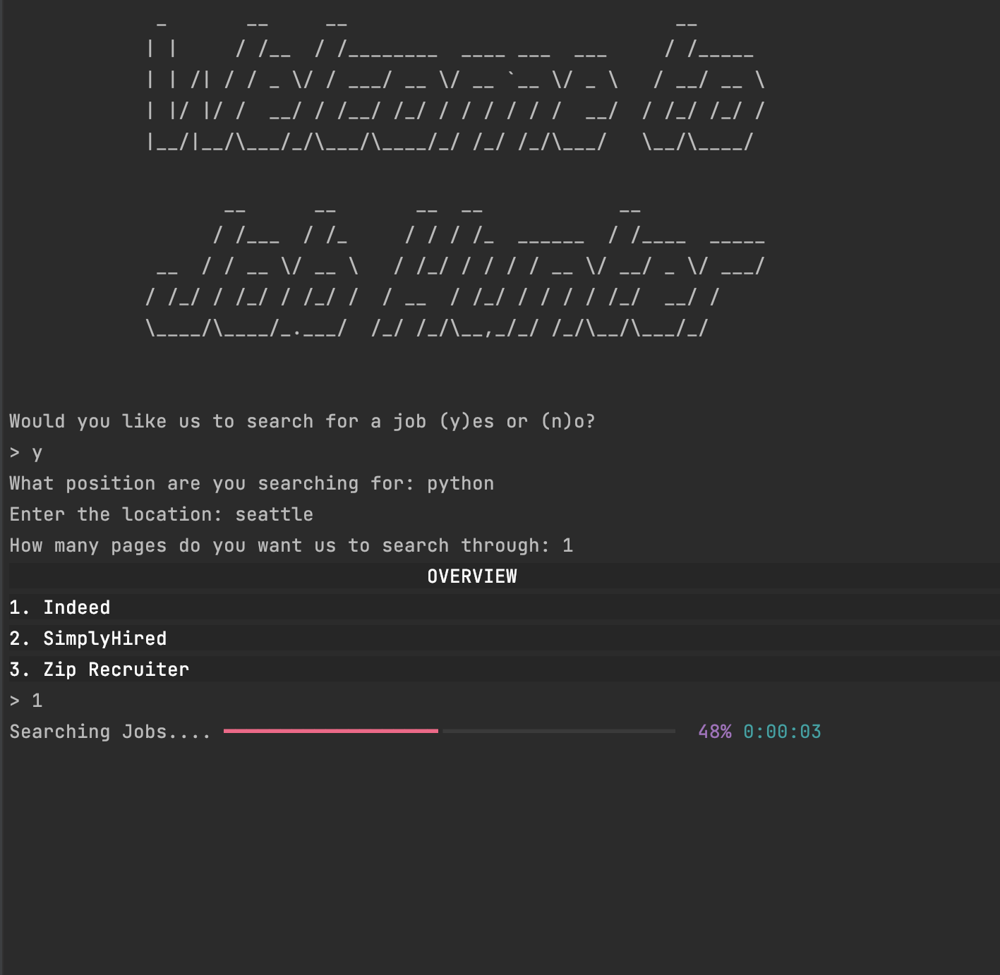
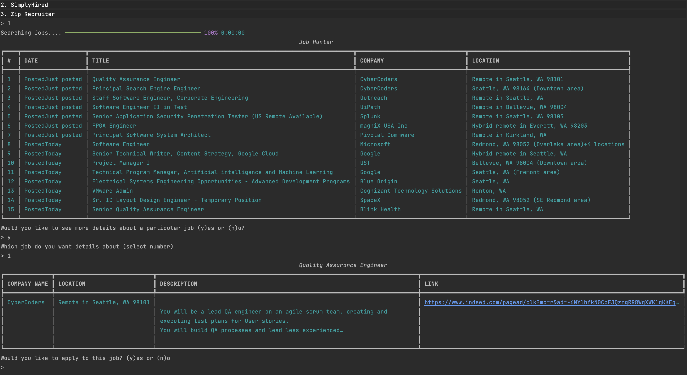
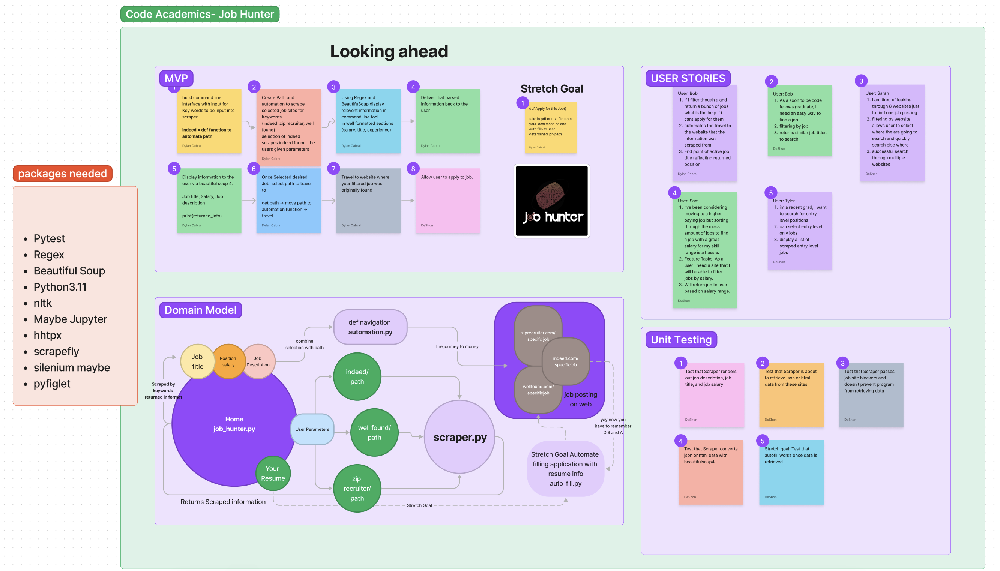
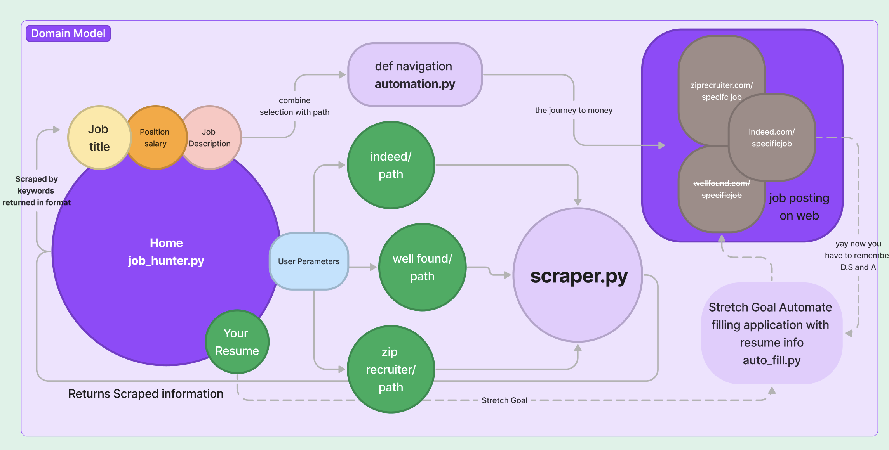
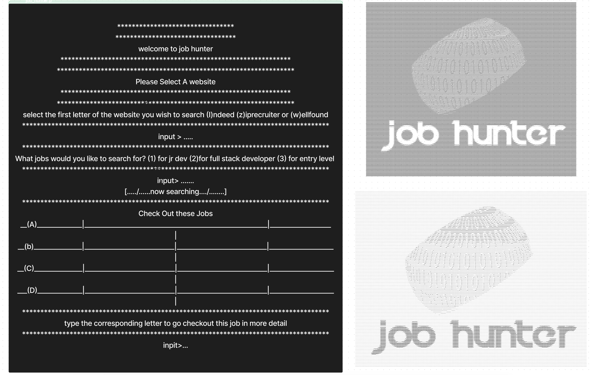
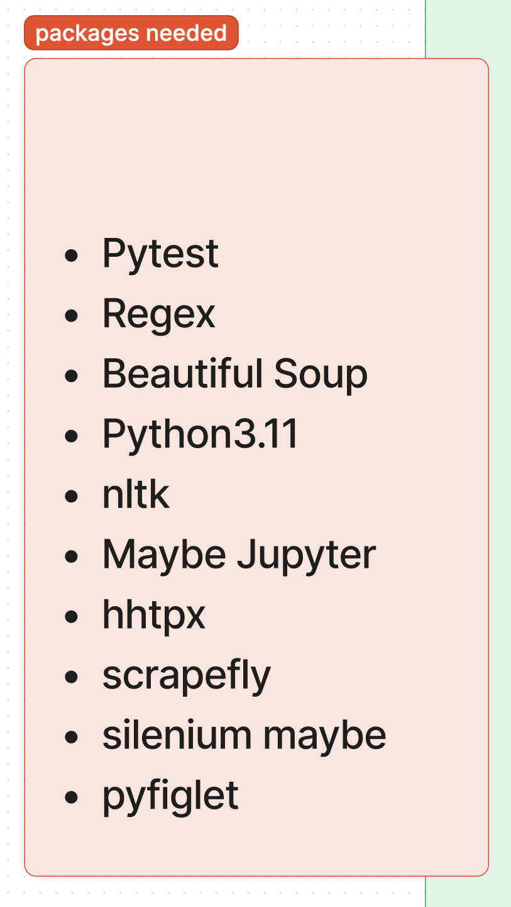

# Job Hunter
DeShon Dixon -- Dylan Cabral -- Don Choi -- Mathieu Roberts -- Eric Mungai

### Overview
-  An automated job application tool that uses web scraping to gather job listings from various job websites, uses regex to extract relevant information such as job title, company, and application link, and then uses remote APIs to gather information about the companies and the application process.

### What problem or pain point does it solve? 
- Problem: The job hunting experience and tedious and stressful. You have to search through thousands of job posting to find jobs that fit you.
- Solution: Helps us currently as we are about to hit the job market can help with the tedious process of job hunting.

--------------

### UML documentation requirements

------------

### Semantic Versioning
- v.001 
- V.002 
- V.003 
- V.004 

### Instructions for local deployment and packages needed
- `git clone https://github.com/CodingAcademics/Back-End`
- cd into the directory
- type `python3.11 ./jobhunter/jobhunter.py` into terminal while inside the directory

## Resources

[Mr Fugu](https://www.youtube.com/watch?v=8XWm99Et0tc)

[ScrapFly](https://scrapfly.io/blog/how-to-scrape-indeedcom/)

[401Github](https://github.com/codefellows/seattle-code-python-401d20/blob/main/class-17/demo/cf-courses/playwright_scraper.py)

[ScrapingBee](https://www.scrapingbee.com/?utm_source=google&utm_medium=cpc&utm_campaign=googletax-1&utm_source=google&utm_medium=cpc&utm_campaign=googletax-1&utm_term=scrapingbee)

[IzzyAnalytics](https://www.youtube.com/watch?v=eN_3d4JrL_w)

[Tech With Tim](https://www.youtube.com/watch?v=gRLHr664tXA)

[StackOverFlow](https://stackoverflow.com/questions/71484660/nonetype-object-has-no-attribute-find-all-error)

[BetterProgramming](https://betterprogramming.pub/designing-beautiful-command-line-applications-with-python-72bd2f972ea)

[BeautifulSoup Docs](https://www.crummy.com/software/BeautifulSoup/bs4/doc/)

[Google Chrome Stable](https://stackoverflow.com/questions/27423684/unable-to-locate-package-google-chrome-stable-ubuntu12-on-openstack)
