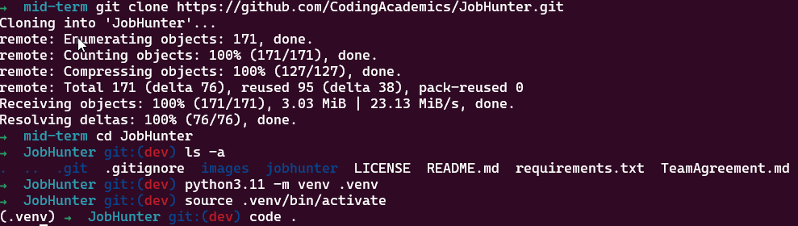
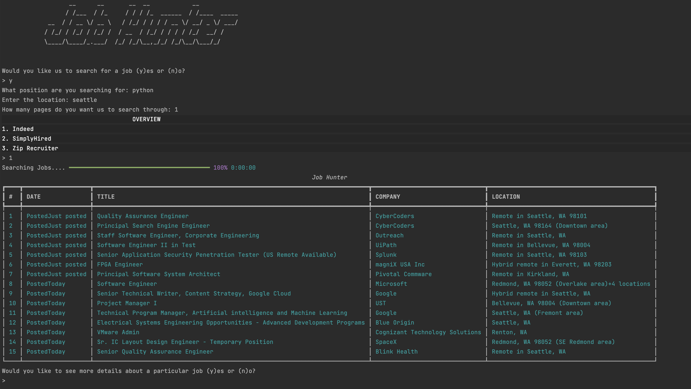

# Job Hunter

DeShon Dixon -- Dylan Cabral -- Don Choi -- Mathieu Roberts -- Eric Mungai


## Overview

- An automated job application tool that uses web scraping to gather job listings from various job websites, uses regex to extract relevant information such as job title, company, and application link, and then uses remote APIs to gather information about the companies and the application process.

- **using our application takes the tedious nature of clicking through every different job site to find your perfect job**

    1. in its current iteration our application scrapes through three different job sites individually returning the information back to the user

    2. We return a digestable table of jobs according to your search perameters be it type of work, how many pages you would like to return, what website or maybe sometime soon, from any we can get information from. utalizing scrapfly and cloud scraper we take your peramaters and scower these websites that we think is relevant toy your search

    3. Great! You have found a bunch of jobs but would love to know more about a specific one.

    4. using our styalized UI follow the prompts and the application will take you right to the company website or the application website, you log in with your credentials and carry on without ever having to typ into google.

### What problem or pain point does it solve?

- Problem: The job hunting experience and tedious and stressful. You have to search through thousands of job posting to find jobs that fit you.

- Solution: Helps us currently as we are about to hit the job market can help with the tedious process of job hunting.

---

### UML documentation requirements


---

## Semantic Versioning

- v.001
- V.002
- V.003
- V.004

## Instructions for local deployment and packages needed

- `git clone https://github.com/CodingAcademics/Back-End`
- cd into the directory
- in JobHunter directory create a virtaul enviornment 



- Inside Virtual enviornment

```python
pip install -r requirements.txt
```

this will ensure that all thae packages and librarys that we used for this project are up to the need of running this file

```python
# from the parent directory 

# You Should be at JobHunter Currently

$ JobHunter/interface.py

# Press enter

# Now the program will take over, follow the prompts and search for your next big thing 
```

---



## Special thanks to scraped websites

- [Indeed](https://www.indeed.com/)
- [SimplyHired](https://www.simplyhired.com/)
- [ZipRecruiter](https://www.ziprecruiter.com/)

## Resources For Building this application yourself

- [Google Chrome Stable](https://stackoverflow.com/questions/27423684/unable-to-locate-package-google-chrome-stable-ubuntu12-on-openstack)

- [How to Use the Rich Library with Python](https://www.freecodecamp.org/news/use-the-rich-library-in-python/)

- [Playwright Documentation](https://playwright.dev/)

- [Cloudscraper docs](https://pypi.org/project/cloudscraper/)

- [pyfiglet for Terminal styling](https://pypi.org/project/pyfiglet/0.7/)

- [Scrapfly Web scraping API documentation](https://scrapfly.io/docs)

- [Mr Fugu](https://www.youtube.com/watch?v=8XWm99Et0tc)

- [401Github](https://github.com/codefellows/seattle-code-python-401d20/blob/main/class-17/demo/cf-courses/playwright_scraper.py)

- [ScrapingBee](https://www.scrapingbee.com/?utm_source=google&utm_medium=cpc&utm_campaign=googletax-1&utm_source=google&utm_medium=cpc&utm_campaign=googletax-1&utm_term=scrapingbee)

- [IzzyAnalytics](https://www.youtube.com/watch?v=eN_3d4JrL_w)

- [Tech With Tim](https://www.youtube.com/watch?v=gRLHr664tXA)

- [StackOverFlow](https://stackoverflow.com/questions/71484660/nonetype-object-has-no-attribute-find-all-error)

- [BetterProgramming](https://betterprogramming.pub/designing-beautiful-command-line-applications-with-python-72bd2f972ea)

- [BeautifulSoup Docs](https://www.crummy.com/software/BeautifulSoup/bs4/doc/)

## Reach out if you want to know more

- [Dylan Cabral LinkedIn](https://www.linkedin.com/in/dylancabral/)
- [DeShon Dixon LinkedIn](https://www.linkedin.com/in/deshondixon)
